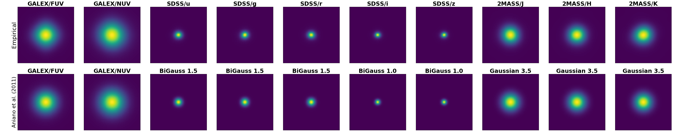

# Empirical PSFs of GALEX, SDSS, and 2MASS

## Description
We construct empirical PSFs of the GALEX (FUV, NUV), SDSS (u, g, r, i, z), and 2MASS (J, H, Ks) using PSF modeling functions in [Photutils](https://photutils.readthedocs.io/en/stable/index.html).
In order to construct the PSFs, first, several images of fields are downloaded from the websites of the GALEX, SDSS, and 2MASS surveys. 
Then background subtraction is done for the 2MASS images using [Background2D](https://photutils.readthedocs.io/en/stable/api/photutils.background.Background2D.html). 
The images from GALEX and SDSS are background free. After that, bright isolated stars are collected using [find_peaks](https://photutils.readthedocs.io/en/stable/api/photutils.detection.find_peaks.html)
and cutouts for the stars are obtained using [extract_stars](https://photutils.readthedocs.io/en/stable/api/photutils.psf.extract_stars.html). 
Visual inspection is done to remove "bad stars" (such as multiple stars in one cutout and saturated star). Then effective PSFs are constructed using [EPSFBuilder](https://photutils.readthedocs.io/en/stable/api/photutils.psf.EPSFBuilder.html).
The number of stars cutouts used for producing the PSFs of FUV, NUV, u, g, r, i, z, J, H, and Ks are 51, 106, 103, 123, 143, 170, 268, 102, 118, and 94, respectively. 

Below is a figure showing the empirical PSFs (first row) from this work compared to the PSFs from [Aniano et al. (2011)](https://ui.adsabs.harvard.edu/abs/2011PASP..123.1218A/abstract) (second row), which are available [here](https://www.astro.princeton.edu/~ganiano/Kernels/Ker_2018/). 

## The FITS files containing the PSFs:
- GALEX/FUV: psf_emp_galex_fuv.fits.gz
- GALEX/NUV: psf_emp_galex_nuv.fits.gz
- SDSS/u: psf_emp_sdss_u.fits.gz
- SDSS/g: psf_emp_sdss_g.fits.gz
- SDSS/r: psf_emp_sdss_r.fits.gz
- SDSS/i: psf_emp_sdss_i.fits.gz
- SDSS/z: psf_emp_sdss_z.fits.gz
- 2MASS/J: psf_emp_2mass_j.fits.gz
- 2MASS/H: psf_emp_2mass_h.fits.gz
- 2MASS/Ks: psf_emp_2mass_k.fits.gz

## How to acknowledge
If you use the empirical PSFs from this repository for your publication, please cite: [Abdurro'uf et al. (2021)](https://ui.adsabs.harvard.edu/abs/2021ApJS..254...15A/abstract) 
